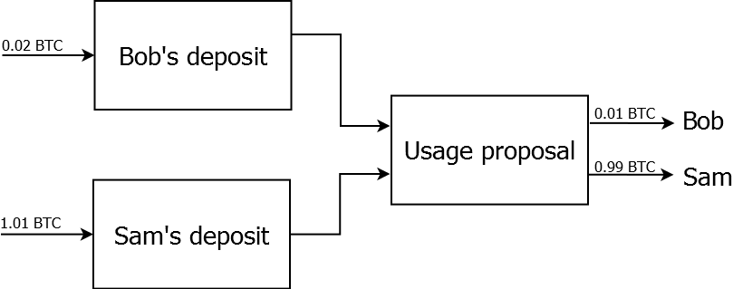
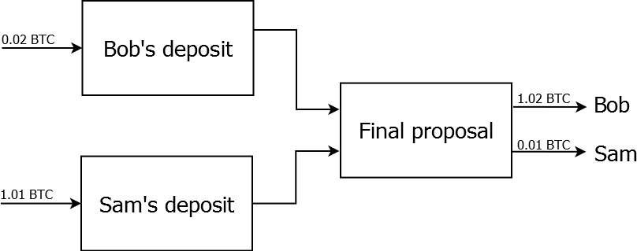

## Introduction

This document describes the Coinffeine exchange protocol. The document is
structured in several sections:

- [Exchanging bitcoins and other currency](#wiki-exchanging-bitcoins-and-other-currency):
  a high level overview of the different approaches to exchanging bitcoins for
  other currency.
- [Protocol overview](#wiki-protocol-overview): a high-level description of the
  exchange protocol.
- [Transaction definitions](#wiki-transaction-definitions): an explanation of
  the protocol at the bitcoin transaction level.
- [Game theory properties](#wiki-game-theory-properties): analysis of the
  protocol as a game played by rational actors

## Exchanging bitcoins and other currency

The Coinffeine protocol is designed to allow two independent individuals to
exchange bitcoins and regular money automatically in a scenario of very low
trust.

Let's say Bob is willing to buy 1 BTC at 100 € and Sam is willing to sell it to
Bob at that exchange rate.

### Trust scenario

In a scenario in which Bob and Sam trust each other, they can just follow the
following steps (steps 2 and 3 are interchangeable):

1. Bob and Sam tell each other their bitcoin address and bank account respectively
2. Bob transfers 100 € to to Sam's account
3. Sam signs a transaction of 1 BTC to the address of Bob

This naïve approach doesn’t work in absence of trust: the first party that pays
is at the mercy of the other one that could refuse to further collaborate.

### Trusted third parties

A typical solution to the problem of lack of trust is to have a trusted third
party that receives the payments and redistributes them again after deducting a
fee. Currently, a handful of bitcoin exchanges (BTC China, MtGox, BitStamp)
play this role in most of the bitcoin / traditional money exchanges.

The trusted third party solution has several disadvantages. These exchanges act
as a single point of failure, which position them as a highly desired target
for both hackers and the government, which can target the different bitcoin
exchanges to prevent people from buying bitcoins.

### Peer-to-peer solution

Coinffeine offers an peer-to-peer solution to enable currency exchange between
bitcoins and other currencies in the absence of trust between the actors that
does not involve a trusted third party. The next section provides a high level
overview of how this is accomplished.

## Protocol overview

Coinffeine uses a [bitcoin contract](https://en.bitcoin.it/wiki/Contracts) known
as _Micropayment Channel_ to create deposits which force users to continue to
cooperate in the transaction if they want to recover the deposit money.

Let's go back to Bob, who wants to buy 1 BTC at 100€, and Sam, who wants to
sell 1 BTC at 100€. Bob and Sam find each other through the P2P network and
decide they want to engage in a transaction to exchange Sam's bitcoin for Bob's
100€. In order to minimize risk they decide they want to perform the exchange
1€ and 0.01 BTC at a time.

They formalize this intent by creating a deposit that expires after a certain
amount of time (let's say 1 hour). That is, they are blocking some funds for
the next hour, which is the time they will have to perform the exchange. Once
the hour is up, they are free to redeem their deposits if the exchange did not
happen.

Bob's deposit will be equal to 2 exchange steps. Since they decided the exchange
was going to happen 0.01 BTC at a time, Bob commits 0.02 BTC in his deposit.
Sam's deposit amounts to 1 exchange step. He also needs to commit the exchange
amount he wants to tranfer to Sam, so he commits 1.01 BTC.


Once the deposits have been set up, which proves that both parties are serious
about the exchange since they have committed funds, the actual exchange beings.
Bob proposes a transaction which uses the money in the deposits. The proposal
uses the money Sam allocated for the exchange and sets the deposits as mining
fees. Sam's allocated funds are split, giving Bob 1 exchange step (0.01 BTC)
and the rest (0.99 BTC) to Sam. Sam signs the proposal and returns it to Bob.



At this point in time, Bob can decide to publish the proposal. This would
use the deposit's funds and would therefore prevent either of them from getting
a refund. If Bob were to do that, he would lose 0.01 BTC (since his deposit was
0.02 BTC) and Sam would lose 0.02 BTC (since he commited 1.01 BTC). This is a
lose-lose situation which is why Bob doesn't have an incentive to publish the
proposal. Since he wants to continue with the exchange, Bob will have to pay 1€
to Sam. This completes one exchange step.

Bob now provides a new proposal to Sam which still loses the deposit's funds as
mining fees and splits Sam's allocated funds giving Bob 0.02 BTC and 0.98 BTC
to Sam. Sam signs, returns the proposal to Bob, and since they are still in a
lose-lose situation Bob has an incentive to transfer 1€ to Sam.

This process is repeated 98 more times until all the funds have been
transferred. Once this has happened, Bob provides a final proposal to Sam, in
which each of them returns their deposits and Bob receives the bitcoins he
already paid for (so 1.02 BTC to Bob and 0.01 BTC to Sam)



Once Sam signs this final proposal and returns it to Bob, he can broadcast it
to the miners so the transaction gets confirmed.

## Transaction definitions

- `TX0.1`: Sam creates and does not share:

```
Inputs: any transaction as long as Sam can sign the SigScript and the amount
        is greater of equal to the exchange amount (E) + Sam's deposit (SD).
Outputs:
- 0:
  - Amount: E + SD
  - Script: MULTISIG with Bob and Sam's key and (n == m == 2)
- 1 (if applicable):
  - Amount: Sum of all inputs - E - SD
  - Script: to Sam's change address
```

- `TX0.2`: Sam creates and shares with Bob:

```
Inputs:
- 0:
  - Hash: Hash(TX0.1)
  - Output index: 0
  - Sequence number: 0
  - SigScript:
Outputs:
- 0:
  - Amount: E + SD
  - Script: to Sam's address
Timelock: T
```

- `TX0.3`: Bob signs `TX0.2` and delivers the signature to Sam, who adds his own
  signature:

```
Inputs:
- 0:
  - Hash: Hash(TX0.1)
  - Output index: 0
  - Sequence number: 0
  - SigScript: MULTISIG with Bob and Sam's SIGHASH_ALL signatures
Outputs:
- 0:
  - Amount: E + SD
  - Script: to Sam's address
Timelock: T
```

- `TX0.4`: Bob creates and does not share:

```
Inputs: any transaction as long as Bob can sign the SigScript and the amount
        is greater of equal to Bob's deposit (BD).

Outputs:
- 0:
  - Amount: BD
  - Script: MULTISIG with Bob and Sam's key and (n == m == 2)
- 1 (if applicable):
  - Amount: Sum of all inputs - BD
  - Script: to Bob's change address
```

- `TX0.5`: Bob creates and shares with Sam:

```
Inputs:
- 0:
  - Hash: Hash(TX0.4)
  - Output index: 0
  - Sequence number: 0
  - SigScript:
Outputs:
- 0:
  - Amount: BD
  - Script: to Bob's address
Timelock: T
```

- `TX0.6`: Sam signs `TX0.5` and delivers the signature to Bob, who adds his own
  signature:

```
Inputs:
- 0:
  - Hash: Hash(TX0.4)
  - Output index: 0
  - Sequence number: 0
  - SigScript: MULTISIG with Bob and Sam's SIGHASH_ALL signatures
Outputs:
- 0:
  - Amount: BD
  - Script: to Bob's address
Timelock: T
```

- Sam broadcasts `TX0.1` and Bob broadcasts `TX0.4`. They wait until they have been
  confirmed.
- `TX1.1`: Bob creates the following transaction and sends it to Sam:

```
Inputs:
- 0:
  - Hash: Hash(TX0.1)
  - Output index: 0
  - SigScript:
- 1:
  - Hash: Hash(TX0.4)
  - Output index: 0
  - SigScript:
Outputs:
- 0:
  - Amount: E/N
  - Script: to Bob's address
- 1:
  - Amount: E - (E/N)
  - Script: to Sam's address
```

- `TX1.2`: Sam signs `TX1.1`, delivers the signature to Bob and Bob completes the
  transaction with his own signature:

```
Inputs:
- 0:
  - Hash: Hash(TX0.1)
  - Output index: 0
  - SigScript: MULTISIG with Bob and Sam's SIGHASH_ALL signatures
- 1:
  - Hash: Hash(TX0.4)
  - Output index: 0
  - SigScript: MULTISIG with Bob and Sam's SIGHASH_ALL signatures
Outputs:
- 0:
  - Amount: E/N
  - Script: to Bob's address
- 1:
  - Amount: E - (E/N)
  - Script: to Sam's address
```

- `TXi.0`: In general, for iteration `i` (`1 <= i <= N`), Bob creates the following
  transaction and sends it to Sam:

```
Inputs:
- 0:
  - Hash: Hash(TX0.1)
  - Output index: 0
  - SigScript:
- 1:
  - Hash: Hash(TX0.4)
  - Output index: 0
  - SigScript:
Outputs:
- 0:
  - Amount: i*E/N
  - Script: to Bob's address
- 1:
  - Amount: E - i*(E/N)
  - Script: to Sam's address
```

- `TXi.1`: If Sam has received `i - 1` payments from Bob, he signs `TXi.0` and returns
  the signature to Bob and Bob completes the transaction with his own signature:

```
Inputs:
- 0:
  - Hash: Hash(TX0.1)
  - Output index: 0
  - SigScript: MULTISIG with Bob and Sam's SIGHASH_ALL signatures
- 1:
  - Hash: Hash(TX0.4)
  - Output index: 0
  - SigScript: MULTISIG with Bob and Sam's SIGHASH_ALL signatures
Outputs:
- 0:
  - Amount: i*E/N
  - Script: to Bob's address
- 1:
  - Amount: E - i*(E/N)
  - Script: to Sam's address
```

- `TX(N+1).0`: Bob creates the following transaction and sends it to Sam:

```
Inputs:
- 0:
  - Hash: Hash(TX0.1)
  - Output index: 0
  - SigScript:
- 1:
  - Hash: Hash(TX0.4)
  - Output index: 0
  - SigScript:
Outputs:
- 0:
  - Amount: E + BD
  - Script: to Bob's address
- 1:
  - Amount: SD
  - Script: to Sam's address
```

- `TX(N+1).1`: If Sam has received `N` payments, he signs `TX(N+1).0` and returns the
  signature to Bob, where he completes the transaction with his own signature:

```
Inputs:
- 0:
  - Hash: Hash(TX0.1)
  - Output index: 0
  - SigScript: MULTISIG with Bob and Sam's SIGHASH_ALL signatures
- 1:
  - Hash: Hash(TX0.4)
  - Output index: 0
  - SigScript: MULTISIG with Bob and Sam's SIGHASH_ALL signatures
Outputs:
- 0:
  - Amount: E + BD
  - Script: to Bob's address
- 1:
  - Amount: SD
  - Script: to Sam's address
```

- Bob broadcasts `TX(N+1).1` and the exchange is complete

## Game theory properties

### Overview

When modeled as a combinatorial game, we have the following properties:

- When all the moves are unrestricted for all player, the proposed algorithm
  does not work since there is an incentive to con the other player and deviate
  from the agrees exchange.
- If we restrict the player's moves on either the buyer or the seller by
  assuming they are using the standard Coinffeine client:
  - The player's dominant strategy is to continue with the exchange once the
    funds have been committed.
  - The player's dominant strategy is to commit the funds if they value the
    other currency more than the currency they are holding (that is, they
    percieve the exchange at the proposed exchange rate as benefitial for them).

### Technical details and proof 

We can model the exchange as a combinatorial game (that is, a sequential game
with perfect information) in which Bob and Sam are perfectly rational players.

Prior to committing the funds, both Bob and Sam have the same set of moves:

- Commit the funds to enter the exchange
- Do not commit the funds to enter the exchange (which finishes the game)

Once the funds have been committed, the set of moves is different for Bob and
Sam. Sam can do the following:

- `Sign`: given a transaction proposal by Bob, Sam can decide to sign it and
  return the signature.
- `Wait_Sam`: Sam can decide to stop playing and wait until the deposits expire, in
  which case he will use the refund transaction if the funds haven't been used
  yet.

Bob has the following set of moves:

- `Pay`: he can transfer Sam 1 exchange step of fiat currency.
- `Offer`: he can propose another transaction to Sam.
- `PayAndOffer`: a convinience move that combines the Pay and Offer move.
- `Wait_Bob`: Bob can decide to stop playing and redeem the deposit after the
  timelock has expired.
- `Publish`: Bob can chose to publish Sam's last signed offer. 

Please note that once Sam has decided to wait, Bob can only play Pay, Wait_Bob
and Publish.

# TODO